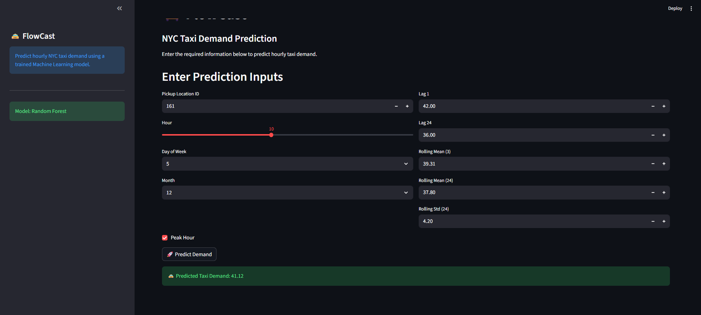

<h1 align="center">🚖 FlowCast</h1>

<p align="center">
  <b>End-to-End Machine Learning Project for NYC Taxi Demand Prediction</b>
</p>

<p align="center">
Built using Python, Scikit-learn, XGBoost, Random Forest, Pandas and Streamlit.
</p>

---

# 📌 Project Overview

FlowCast is an end-to-end Machine Learning project that predicts hourly NYC taxi demand using historical taxi trip data.

The project follows the complete ML workflow:

- Data Collection
- Data Cleaning
- Exploratory Data Analysis (EDA)
- Feature Engineering
- Model Training
- Model Evaluation
- Model Deployment using Streamlit

The final application allows users to enter taxi demand features and instantly receive a prediction through an interactive web interface.

---

# 🚀 Demo

## Streamlit Web Application

> *(Add your deployed Streamlit link here after deployment)*

```
https://your-flowcast.streamlit.app
```

---

# 📷 Application Preview



---

# ✨ Features

- End-to-End Machine Learning Pipeline
- NYC Taxi Demand Prediction
- Time-Series Feature Engineering
- Interactive Streamlit Dashboard
- Real-Time Predictions
- Random Forest Model Deployment
- Clean Modular Project Structure

---

# 🛠 Tech Stack

### Programming

- Python

### Data Analysis

- Pandas
- NumPy

### Machine Learning

- Scikit-learn
- XGBoost

### Visualization

- Matplotlib

### Deployment

- Streamlit

---

# 📂 Project Structure

```
FlowCast/
│
├── dashboard/
│   └── app.py
│
├── data/
│   ├── raw/
│   └── processed/
│
├── images/
│
├── models/
│   └── best_model.pkl
│
├── notebooks/
│   ├── 01_data_loading.ipynb
│   ├── 02_eda.ipynb
│   ├── 03_demand_aggregation.ipynb
│   ├── 04_feature_engineering.ipynb
│   ├── 05_model_training.ipynb
│   └── 06_model_deployment.ipynb
│
├── reports/
│
├── requirements.txt
│
└── README.md
```

---

# 📊 Machine Learning Pipeline

```
Raw Taxi Data
        │
        ▼
Data Cleaning
        │
        ▼
Exploratory Data Analysis
        │
        ▼
Demand Aggregation
        │
        ▼
Feature Engineering
        │
        ▼
Model Training
        │
        ▼
Model Evaluation
        │
        ▼
Best Model Selection
        │
        ▼
Streamlit Deployment
```

---

# 🤖 Models Trained

- Linear Regression
- Random Forest
- XGBoost

Random Forest achieved the best performance and was selected as the final deployed model.

---

# 📈 Input Features

The deployed model predicts taxi demand using:

- Pickup Location ID
- Hour
- Day of Week
- Month
- Weekend Indicator
- Lag 1
- Lag 24
- Rolling Mean (3)
- Rolling Mean (24)
- Rolling Standard Deviation (24)
- Peak Hour Indicator

---

# ▶️ Installation

Clone the repository

```bash
git clone https://github.com/agnishwar16/flowcast.git
```

Move into the project

```bash
cd flowcast
```

Install dependencies

```bash
pip install -r requirements.txt
```

Run the application

```bash
streamlit run dashboard/app.py
```

---

# 🎯 Future Improvements

- Deploy using Streamlit Community Cloud
- Add live weather features
- Include holiday effects
- Hyperparameter tuning
- Deep Learning (LSTM) model
- API deployment using FastAPI

---

# 👨‍💻 Author

**Agnishwar Mukherjee**

B.Tech CSE (AI Specialization)


GitHub:
https://github.com/agnishwar16